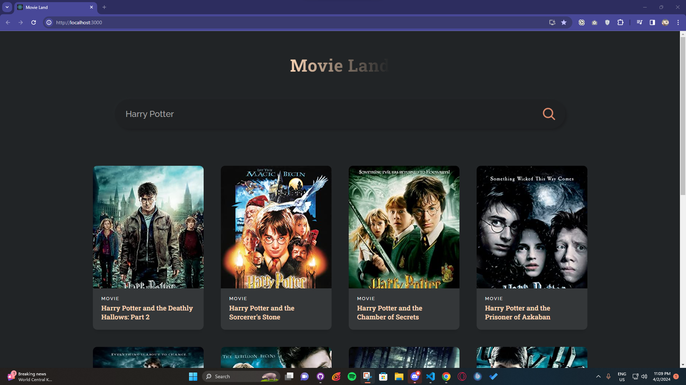
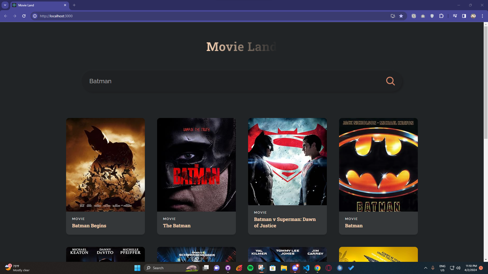

# Movie Land

Welcome to Movie Land, a React project that fetches movie data from an API and displays it to users. With Movie Land, you can explore a vast collection of movies, search for specific titles, and discover new favorites.

## Features

- **Movie Data**: Fetches movie data from an API and displays it on the website.
- **Search Functionality**: Allows users to search for movies by title.
- **Responsive Design**: Ensures a seamless viewing experience across devices of all sizes.
- **Use of Hooks**: Utilizes useState and useEffect hooks to manage state and side effects.

## Courtesy
<https://youtu.be/b9eMGE7QtTk?si=eYAaEeZBG9i0_YPW>
